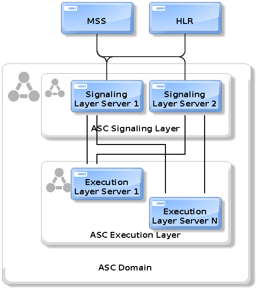
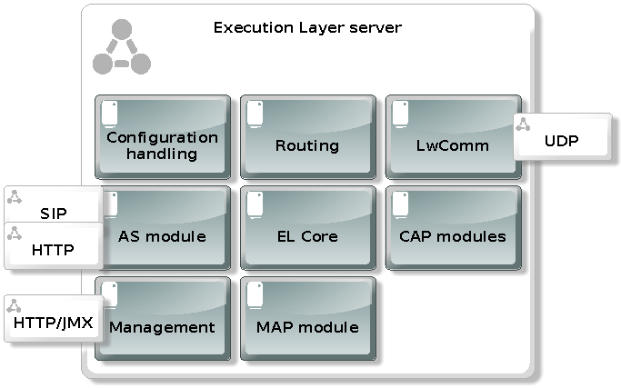

[[_design]]
= Design

[[_system-architecture]]
== System architecture

IM-SCF (Reverse IM-SSF) is a protocol converter between core
telecommunication components and the application servers hosting
telecommunication services. IM-SCF communicates with telco components on
SS7 (CAMEL and MAP) protocol over SCTP. The interface between IM-SCF and
application servers use a high-level SIP protocol.

[[_architecture-diagram]]
=== Architecture diagram

image:images/Design_Arch_Diag.png[image,width=353,height=590]

[[_telco-network-and-im-scf]]
==== Telco Network and IM-SCF

IM-SCF connects to Telco networks using SCTP protocol because of its
reliability. Depending on what type of system IM-SCF connects to, there
are various protocols used over SCTP:

* Connection between MSS (Mobile Switching Centre Server) and IM-SCF
uses SCCP+CAMEL over SCTP. This connection is used to transfer call
control messages, e.g. an InitialDP CAMEL message from MSS to IM-SCF to
signal that a call has been initiated
* Connection between HLR (Home Location Register) and IM-SCF uses
SCCP+MAP over SCTP. This connection is used to issue subscriber queries
from IM-SCF towards HLR, e.g. AnyTimeInterrogation (location and status)
query

[[_networks-and-peer-systems]]
=== Networks and peer systems

The following table summarizes the networks and connecting systems.

[cols=",", frame="all", options="header",]
|=====================================================
|Network |Connecting systems
|SIGTRAN / SS7 |HLR, MSS
|SIP |Application Servers
|INTERNAL |IM-SCF nodes internal
|EXTERNAL |Servers are reachable for the outside world
|=====================================================

[[_im-scf-design]]
== IM-SCF design

[[_im-scf-inner-architecture]]
=== IM-SCF inner architecture

In order to properly handle huge traffic while maintaining the
robustness of the architecture, the IM-SCF is implemented by two types
of servers:

* Signaling Layer server
* Execution Layer server

The following sections provide detailed information about the roles and
structure of the servers. The IM-SCF inner structure can be seen in the
following figure.

IM-SCF servers are organized into domains. An IM-SCF domain is an
administration concept, it does not appear as a separate module or
server. When we talk about configuring IM-SCF, it means configuring an
IM-SCF domain. The domain configuration contains all necessary
information to set up and run the signaling and execution layer servers
of the domain.

As can be seen on the example above Signaling Layer servers are not
interconnected but they are connected to all Execution Layer servers in
the IM-SCF domain. Execution Layer servers do not have connection to
each other as well. The connection is over an UDP-based protocol named
LwComm (LightWeight Communication), which is developed specifically for
the needs of IM-SCF inter-node communication.

[[_common-modules]]
==== Common modules

Execution and Signaling Layer servers share some functionality. Usually,
configuration and management modules are very similar in the servers:

*Configuration handling*

This module is responsible for interpreting the domain configuration,
setting up the related modules and responding to configuration changes.

*Management*

This module is partly inside the containing JBoss AS: every JBoss AS has
a management port defined. This management port has multiple roles:

* a HTTP application is reachable through which the underlying JBoss AS
can be configured
* the server is reachable on remote JMX protocol through this port
* the Signaling or Execution Layer application exposes a HTTP
application as well to receive notification of configuration change

*LwComm*

This module is responsible for the communication between SL and EL
nodes. See section Communication for details.

[[_jboss-application-server]]
==== JBoss Application Server

An IM-SCF (signaling or execution layer) server is basically a Java
process communicating over the specified interfaces and protocols. This
Java process is essentially a JBoss Application Server process and the
IM-SCF itself is a WAR (Java Web Archive) application deployed in the
JBoss Application Server.

JBoss Application Server has been chosen as a host of the IM-SCF
application for the following reasons:

* It is mature, the JBoss AS has been in use widely for the last decade
* A large company as RedHat is behind the development so there is no
risk that maintenance suddenly ends
* The free version suits our needs

[[_signaling-layer]]
=== Signaling Layer

The Signaling Layer’s task is to communicate with telco 
systems using SS7 and SCTP protocols. The Signaling Layer acts as the
message middleware between the Execution Layer and the connecting
systems – the Execution Layer uses it as a messaging system. The
Signaling Layer does not process messages neither from telco system nor
from Execution Layer, it just sends the messages to their appropriate
destination.

The Signaling Layer has the following main parts apart from those
described above:

*SL Core*

The core module is the “heart” of the Signaling or Layer instance. It
manages the other modules, receives callbacks and sends messages to the
appropriate direction.

*SIGTRAN / SS7*

The Signaling Layer establishes and maintains SCTP associations towards
MSSs, and HLRs through the SIGTRAN / SS7 module which
utilizes the Linux kernel module “sctp”. The SS7 messages are
sent through these SCTP associations.

The SIGTRAN / SS7 module has extensive configuration see section
Configuration below.

[[_execution-layer]]
=== Execution Layer

Execution Layer servers implement the “logic” of IM-SCF. Roughly, their
task is to interpret the messages from application servers and core
network components and send the appropriate messages to the other side.

This behavior is implemented by various modules in the EL server shown
on the next figure.

*EL Core*

The core module is similar to SL core. It manages the other modules,
receives callbacks and sends messages to the appropriate direction.

*AS module*

The AS module handles the SIP connections towards Application
Servers. This module is responsible for sending and receiving SIP 
messages to and from application servers and monitoring which SIP
application servers are reachable in order to implement failover. This
monitoring is achieved by periodically sending SIP OPTIONS messages to
all SIP application servers and those servers who do not answer in time
with a SIP 200 OK message are considered as dead for the next time
period and no calls will be routed to them.

*MAP module*

The MAP module is responsible for constructing and interpreting MAP
messages. The IM-SCF is able to send AnyTimeInterrogation message to
HLRs and is able to process its response, the AnyTimeInterrogationResult
message.

*CAP modules*

CAP modules are in fact where the SIP<->CAMEL protocol conversion
happens. CAMEL phases 2, 3 and 4 is supported by IM-SCF. The following
messages in the respective CAMEL phases are supported by IM-SCF:

[cols=",,,",frame="all",options="header",]
|=======================================================================
|Operation |*PHASE 2* |*PHASE 3* |*PHASE 4*
|ActivityTest |X |X |X

|ApplyCharging |X |X |X

|ApplyChargingReport |X |X |X

|Cancel |X |X |X

|Connect |X |X |X

|ConnectToResource | | |X

|Continue |X |X |X

|ContinueWithArgument | | |X

|DisconnectForwardConnection | | |X

|DisconnectForwardConnectionWithArgument | | |X

|DisconnectLeg | | |X

|EventReportBCSM |X |X |X

|FurnishChargingInformation |X |X |X

|InitialDP |X |X |X

|InitiateCallAttempt | | |X*

|MoveLeg | | |X

|PlayAnnouncement | | |X

|PromptAndCollectUserInformation | | |X

|ReleaseCall |X |X |X

|RequestReportBCSMEvent |X |X |X

|ResetTimer |X |X |X

|SpecializedResourceReport | | |X

|SplitLeg | | |X
|=======================================================================

pass:[*] The InitiateCallAttempt CAMEL phase 4 operation is partly implemented currently.

There can be multiple CAP modules defined with different parameters.
Calls can be routed to a specific CAP module in order to fulfill
different requirements of different services.

*Routing*

In general, routing module handles the following situations:

* which CAP module should handle the incoming call
* which SIP application server should handle the incoming call

In case of incoming calls, the decision criteria is a combination of
service key range list and TCAP application context.

[[_communication]]
=== Communication

Signaling and Execution Layer servers are sending messages to each other
while servicing a call. Depending on the type of the call, on average 20
messages are sent between an EL and SL node. That means, if for example
the load is 100 (initiated) calls per second (CPS) then the message rate
is 2000 messages per second (MPS). This is quite a heavy load and the
underlying messaging system must be chosen carefully to meet the
requirements. There are many messaging systems performing well, so there
is a lot to choose from (HornetQ, ZeroMQ, RabbitMQ, ApacheMQ).

IM-SCF uses UDP for internal communication. This is because we
experienced that despite the reliable network components and the high
quality software, on the long run TCP can fail some time. The failure is
transient, cannot be explained, maybe just a short glitch in one of the
routers or switches, but the result is that the TCP streams hang, the
processes must be shut down and restarted. From the product list above
only ApacheMQ supports communication over UDP but on the other hand,
ApacheMQ is a huge service broker application in itself and we do not
want to introduce new components in the architecture. That’s why we
decided to implement a new, simple, UDP-based messaging system which is
designed exactly for the situation of IM-SCF.

The newly developed communication system is called Lightweight
Communication Protocol, or LwComm. The following preconditions were
assumed while designing the protocol:

* The protocol will be used among nodes in the same high-speed, highly
reliable LAN network, so losing of UDP protocols is possible but not
common
* The network is symmetric: if node A’s LwComm port is reachable from
node B that means that a node B’s LwComm port is reachable from node A
as well (this is required for the heartbeat mechanism)
* The set of nodes communicating each other is fixed in a configuration,
no new nodes are added to or removed from the configuration at runtime.

The following requirements were taken into account while designing the
protocol:

* The protocol must be over UDP
* The protocol must be simple both by means of structure and by means of
usage
* Must manage the high load described above
* Must manage UDP packet loss in a simple way

The following decisions were made during design:

* LwComm is a text-based protocol over UDP
* Nodes send heartbeat messages to each other to notify the other node
that they are alive (there is no answer for a heartbeat)
* When a message is sent, the receiver sends an ACK message to notify
the sender that the message has been received
* If there is no ACK received at the sender, retransmit intervals can be
defined so the message can be repeated multiple times
* Each message has a unique identifier, so duplicates can be filtered on
receiving side (in case when the ACK is lost)

[[_redundancy]]
=== Redundancy

In order to cope with hardware and software failure, IM-SCF must be
designed that an error in one component does not have the effect of
performance or quality loss. In order to achieve this, the system is
designed to redundant in many points.

[[_sctp-network-failure]]
==== SCTP network failure

SCTP provides redundant paths to increase reliability.

Each SCTP endpoint need to check reachability of Primary and redundant
addresses of remote end point using SCTP HEARTBEAT. Each SCTP end point
need to acknowledge (HEARTBEAT ACK) the heartbeats it receives from
remote end point.

The following figure illustrates SCTP multi-homing (figure from ):

[[_m3ua-protocol-redundancy]]
==== M3UA protocol redundancy

Beyond SCTP multihoming there’s an additional level of redundancy on one
level above, on the M3UA layer. Signaling Layer servers reach MSSs on
M3UA level using two SCTP associations: primary and secondary.

By default, the primary SCTP association is used, and when problems
detected the communication is switched to the secondary association.

[[_global-title-routing-in-signaling-layer-server]]
==== Global Title Routing in Signaling Layer server

In Signaling Layer server configuration, two pointcodes can be given
which are capable of Global Title Translation. SL servers route messages
with unknown target global title addresses to the pointcodes defined
here. By default, SL server load balances between these pointcodes, when
a problem is detected with one of them it automatically starts to use
the other only.

[[_signaling-layer-server-failure]]
==== Signaling Layer server failure

Signaling Layer servers communicate with telco components (MSS, HLR) and 
Execution Layer servers. These directions worth observing individually in terms 
of redundancy.

*GT resolving and geo-redundancy*

Addressing in the telco world is done using global title addresses (GT),
pointcodes (PC) and subsystem numbers (SSN). Without going in too much
detail, we can consider, that an IM-SCF domain is seen as a global title
address by MSSs and HLRs. A global title is resolved to a pointcode to
address a single system. A Signaling Layer server has a pointcode
assigned to it. So if an SS7 message’s target is a global title, there
must be a phase which resolves the global title to a point code.

This resolution happens in the MSSs. An MSS has a GT translation table
which assigns a primary and a secondary point code to a GT. This means
that if a message’s target is a given GT, it will be sent to the system
with the primary point code if it’s available, and to the secondary if
it’s not. This way, if a signaling server dies, its secondary pair will
handle the messages if it was the primary pointcode in an MSS. So there
are two Signaling Layer servers for a global title.

*Execution Layer server -> Signaling Layer server*

In case of network-initiated calls, the Execution Layer server must
communicate with the same Signaling Layer server for all messages
exchanged during call servicing. So, if a Signaling Layer server dies
while a call is processes, the EL server has no option, the call is
lost.

In case of user (AS-) initiated calls, the EL server can choose randomly
from the available SL servers for the first message.

[[_execution-layer-server-failure]]
==== Execution Layer server failure

Execution Layer servers are equivalent in the IM-SCF domain. This means
that they have exactly the same capabilities so if a call or request can
be routed to one of them, it means that it can be routed to all of them.

*Signaling Layer -> Execution Layer direction*

Execution Layer servers periodically send heartbeats to all Signaling
Layer servers, so a Signaling Layer server knows exactly at a given time
instant which Execution Layer servers are available for processing
calls. When a decision has been made, the target of the first message is
chosen randomly from the available EL servers. The SL server takes a
note that which EL processes the call in question and all subsequent SS7
messages will be routed to this same EL instance. There is no session
replication among EL servers: this means that if an EL server goes down
while servicing calls, the ongoing calls serviced on this instance will
be lost.

*Application Server -> Execution Layer direction*

Application servers can initiate processes (calls and HLR queries)
towards EL servers as well. In this case the first message is sent by
the AS to an Execution Layer server. To know which EL servers are alive
and can receive such requests, all AS servers periodically send ping
requests to their respective EL instances. EL servers which do not
answer these ping requests in time will not receive ICA
(InitiateCallAttempt) or HLR query messages from application servers.
Additionally, the AS layer failovers the messages towards the EL layer.
This means that if the first message could not be sent to an EL instance
then the AS marks the target EL instance as unavailable for a
configurable time interval and tries the next EL instance.

*AS -> IM-SCF -> HLR failover*

It is a typicall design that HLR service has multiple frontends. Assume we have two frontends: HLRFE1 and HLRFE2. Both HLR servers are capable for returning subscriber, location and flexible numbering information for IM-SCF queries. Application servers initiate queries
towards HLRs through IM-SCF by exactly specifying which HLR (HLRFE1 or
HLRFE2) to query the information from. Since both HLRs can return the
data, if the AS layer experiences that the chosen HLR server is not
available it tries the other – so this level of failover is not done on
IM-SCF level.

[[_application-server-failure]]
==== Application server failure

IM-SCF defines application server groups which are collections of
application servers. Calls are routed to application server groups
instead of individual application servers. Since the heartbeat mechanism
IM-SCF EL server always knows which application servers in a group are
alive it can always pick a suitable application server for the call.

In case application server failure, the calls serviced on that
individual servers are lost since there is no session replication
between application servers.

[[_ip-network-failover]]
==== IP network failover

*Physical machines*

Machines have multiple Ethernet ports and can use them for the same
network using network bonding. Network bonding is a computer networking
arrangement in which two or more network interfaces on a host computer
are combined for redundancy or increased throughput. In this case two
interfaces are used for redundancy. The ports are used in active-active
mode so in normal operation both ports are transmitting data and when
one of the ports goes down, the other is capable of transmitting the
whole traffic.

*Cloud environment*

Virtual machines run on the compute nodes of the cloud architecture.
These compute nodes have two interfaces in bonding configuration and
physically are connected to a redundant pair of switches.

[[_hardware-failure-on-physical-machines]]
==== Hardware failure on physical machines

Deployed physical machines have hardware redundancy on multiple
construction parts:

* there are two blade frames deployed on each site
* inside a blade frame there are multiple machines for the same purpose
* hard disks installed in the machines are redundant
* the machines getting power from a redundant supply

[[_scaling]]
=== Scaling

Scaling is the steps of changes in a system required to cope with
increased load. A system is easily scalable if these steps include
simply adding new servers to the domain.

[[_scaling-of-signaling-layer-servers]]
==== Scaling of Signaling Layer servers

Since the nature of GT resolution involves two pointcodes, this usually
determines that there are two Signaling Layer servers for a given GT.
This pattern has been successfully used in several installations, this
is the recommended approach. Signaling Layer servers do not do any
processing on the messages, they act merely as dispatchers.

On the rare case when the current Signaling Layer throughput is not
enough, the following changes can be done to increase performance
without touching the architecture:

* If SL servers are low on memory, the Java heap can be increased
* If SL servers are low on CPU, the machines can be examined, other
CPU-intensive processes should be moved to other machines, or the
machines can be given more CPU power

[[_scaling-of-execution-layer-servers]]
==== Scaling of Execution Layer servers

Execution Layer servers are identical from the point of view of both
application servers and SL servers so the Execution Layer can easily be
extended by installing new instances.

[[_overload-protection]]
==== Overload protection

There can be situations, when even there are sufficient number of
servers with the proper amount of resources assigned to them, the load
is as high that the system’s throughput is not enough to properly serve
the increased load. In these situations, the expectations towards the
system are the following:

* “graceful degradation” – the system must not collapse, it should
handle the part of the traffic that it is planned for
* after the unexpected load ceases, the system must recover, i.e. the
CPU and memory utilization should be back to normal

To achieve the above, an overload protection mechanism is implemented
into IM-SCF. The overload protection mechanism is triggered by the
extreme usage of the two main resources CPU and memory. That means if
the system CPU usage or the Java heap usage reaches a certain
(configurable) threshold then the overload mode is turned on. In
overload mode, the IM-SCF will respond to all network-initiated calls
with TCAP abort. This is expected to lower the usage of system resources
and protects the servicing of the ongoing calls.

[[_configuration]]
== Configuration

Behavior and parameters of SL and EL servers are stored in IM-SCF
configuration. As mentioned earlier, IM-SCF configures the servers by
creating IM-SCF domains and assign a configuration to these domains. All
properties required to run SL and EL servers, and even the servers
themselves are present in the configuration.

[[_general-guidelines-format]]
=== General guidelines, format

The configuration is stored in an XML file. Because of the many modules
and parameters, this file is quite huge. For that reason, scripts are
provided which help the operation team to do regular tasks easily.

When publishing a new configuration, it is assigned a new version number
and stored in a persistent storage. This happens every time a
configuration is published so it is easy to reload the configuration
from any given state provided it is compatible with the system currently
running. The configuration versioning also provides a history of the
evolution of the configuration. When someone spots a suspicious
configuration setting the history might reveal who and why made that
change.

[[_signaling-layer-configuration]]
=== Signaling Layer configuration

SIGTRAN configuration is relevant for Signaling Layer servers. Since the
SIGTRAN configuration involves a lot of properties which is tightly
depends on the server’s own parameters (local IP, local port for SCTP
associations, local point code for M3UA routes, etc.) IM-SCF
configuration introduces M3UA, SCCP local, and SCCP remote profile
configurations. These profiles can then be assigned to individual
Signaling Layer servers. This structure allows that servers have the
same SIGTRAN settings with minimal configuration efforts.

[[_sctp-associations-and-m3ua-profiles]]
==== SCTP associations and M3UA profiles

IM-SCF configuration builds up SCTP associations independently from the
remote and local side. There is a global SCTP association remote side
list which contains all remote systems with their SCTP addresses.

An M3UA profile in terms of IM-SCF configuration means a list of M3UA
routes. An M3UA route defines that which remote SCTP associations
(primary and secondary) should be used when connecting to a target
remote pointcode.

[[_sccp-local-profile]]
==== SCCP Local profile

The SCCP local profile describes the Signaling Layer server’s SCCP
addresses, how the node is visible for the telco network. This includes
setting the server’s

* subsystem numbers
* global title addresses at which it is visible

The values here will determine the calling party address part of
IM-SCF’s outgoing SCCP messages.

[[_sccp-remote-profile]]
==== SCCP Remote profile

SCCP remote profile describes the remote systems accessed by a Signaling
Layer server. Remote systems can be addressed either by

* subsystem number and pointcode
* global title address

Each type of remote system can be defined here and is assigned an alias.
When IM-SCF sends out a message towards an alias, the settings here
determine the called party address part in the outgoing SCCP message.

Apart from the above, the SCCP remote profile also contains an entry
related to GT routing: two pointcodes can be defined where global title
translation is available.

[[_connecting-profiles]]
==== Connecting profiles

When defining a Signaling Layer server, the parameters below must be
assigned.

* Connectivity – listen addresses and ports
* Local SCTP addresses
* Local SCTP address – M3UA profile assignment
* Point code

[[_execution-layer-configuration]]
=== Execution Layer configuration

Execution layer configurations does not involve the concept of profiles
since Execution Layer servers are designed to be identical. The
configuration specifies the SIP application servers, how the
calls should be routed to these endpoints, CAP and MAP 
modules.

[[_application-server-configuration]]
==== Application Server configuration

SIP application servers can be defined in IM-SCF. SIP
application servers handle calls arriving on CAMEL protocol from MSSs.

Both types of application servers are organized into groups (when
defining a call routing, a destination is always a group, IM-SCF never
addresses application servers individually).

A SIP application server is identified by its name and has three
properties: IP address, SIP port, and a flag if heartbeat is enabled for
the AS or not. If heartbeat is enabled, IM-SCF periodically sends SIP
OPTIONS messages to the server and if the server replies with a SIP 200
OK then IM-SCF marks the server as alive and capable of handling calls.
If not, the server is marked as unavailable and no calls will be routed
there. If heartbeat is turned off for an application server, IM-SCF
assumes that it is available.

SIP application servers are defined inside SIP application server
groups. The group determines that in what distribution should the
contained application servers requested to handle a call. The
possibilities are:

* load-balance (the target AS is chosen randomly from the available
application servers)
* failover (the first available AS in the list is requested)

[[_cap-configuration]]
==== CAP configuration

IM-SCF configuration allow to define multiple CAP modules for an IM-SCF
domain. CAP module configuration is extensive and covers the following
fields:

* SIP parameters, timer values
* CAMEL reset timer and activity test message settings
* Defines media resources (MRFs)
* Defines timeout towards SIP AS and behavior when SIP AS answers with
error for INVITE
* IN triggering – the default configuration to use when sending
RequestReportBCSM operations

[[_map-configuration]]
==== MAP configuration

There can be multiple MAP modules in an IM-SCF domain. The MAP module
configuration specifies only two parameters:

* The GSM-SCF address (a global title) to put into the
AnyTimeInterrogation MAP message
* The amount of time to wait for the answer to AnyTimeInterrogation from
HLR

[[_routing-configuration]]
==== Routing configuration

The following routing decisions have to be made by IM-SCF while in
operation:

* Which CAP module should serve an incoming, network-initiated call?
* Which SIP application server should serve an incoming,
network-initiated call?
* Which CAP module should serve an incoming, AS-initiated call
(click-to-dial)?
* Which MAP module should serve an incoming user status request or
flexible numbering query from AS?

The following routing decisions are made by the rules defined in the
configuration.

*Routing calls to CAP modules and SIP application servers*

The criteria for call routing is the combination of:

* application context
* service keys

Application context specifies a TCAP level application context: CAMEL
phase 2, 3 or 4 (in case of phases 3 and 4 SMS as well) and MAP. Only
the CAMEL is used when routing calls. The target for a call routing is a
CAP module defined in the configuration and a list of application server
groups.

*Routing user status requests and flexible numbering queries from
application servers*

User status requests and flexible numbering (FNR) queries arrive in SIP
SUBSCRIBE requests from SIP application servers. These requests must be
assigned a MAP module. In the rare case when there are more than one MAP
modules present in IM-SCF, the destination module must be chosen. This
can be done by analyzing the SUBSCRIBE requests and matching a header
against a pattern – the header and the pattern to match is defined in
the routing configuration.

*Routing click-to-dial requests from application servers*

The appropriate CAP module constructing the CAMEL InitiateCallAttempt
from the incoming SIP INVITE from AS is chosen like the MAP module is
chosen for handling a SUBSCRIBE request: a SIP request header pattern
matching.

[[_tools-components-and-libraries]]
== Tools, components and libraries

This section summarizes the third-party software components used by the
IM-SCF software.

[[_java-8]]
=== Java 8

Java version 8 is chosen as the Java virtual machine for running IM-SCF
servers. Java version 8 has been released in March 2014 and is
considered to be mature.

Java 8 introduces various improvements both in the Java language itself
and in the performance of the virtual machine.

[[_jboss-application-server-1]]
=== JBoss Application Server

IM-SCF binaries run in an application server and for the reasons listed
in 2.2.1.2 JBoss Application Server version 10.0.0 (codename: Wildfly) has
been chosen as the platform.

JBoss WildFly, formerly known as JBoss AS, or simply JBoss, is an
application server authored by JBoss, now developed by Red Hat. WildFly
is written in Java, and implements the Java Platform, Enterprise Edition
(Java EE) specification. It runs on multiple platforms.

WildFly is free and open-source software, subject to the requirements of
the GNU Lesser General Public License (LGPL), version 2.1.

[[third-party-libraries]]
=== External libraries

The IM-SCF project uses the libraries listed below.

**Google Guava +
**https://code.google.com/p/guava-libraries/[_https://code.google.com/p/guava-libraries/_] +
The Guava project contains several of Google's core libraries that are
used in Java-based projects: collections, caching, primitives support,
concurrency libraries, common annotations, string processing, I/O, and
so forth.

**jain-sip +
**https://code.google.com/p/jain-sip/[_https://code.google.com/p/jain-sip/_] +
JAIN-SIP is a low level Java API specification for SIP Signaling.

**Javolution +
**http://javolution.org/[_http://javolution.org/_] +
Javolution is a real-time library aiming to make Java or Java-Like/C++
applications faster and more time predictable.

**lksctp +
**http://lksctp.org/[_http://lksctp.org/_] +
The lksctp-tools project provides a Linux user space library for SCTP
(libsctp) including C language header files (netinet/sctp.h) for
accessing SCTP specific application programming interfaces not provided
by the standard sockets, and also some helper utilities around SCTP.

*logback* +
http://logback.qos.ch/[_http://logback.qos.ch/_] +
Logback is intended as a successor to the popular log4j project, picking
up where log4j leaves off.

**Restcomm jSS7 +
**https://code.google.com/p/jss7/[_https://code.google.com/p/jss7/_] +
Open Source Java SS7 stack that allows Java apps to communicate with
legacy SS7 communications equipment.

**Restcomm sip-servlets +
**http://www.mobicents.org/products_sip_servlets.html[_http://www.mobicents.org/products_sip_servlets.html_] +
Restcomm Sip Servlets delivers a consistent, open platform on which to
develop and deploy portable and distributable SIP and Converged JEE
services.

**Restcomm SCTP +
**https://code.google.com/p/sctp/[_https://code.google.com/p/sctp/_] +
Restcomm SCTP Library is providing the convenient API's over Java SCTP.

**Restcomm jASN +
**https://code.google.com/p/jasn/[_https://code.google.com/p/jasn/_] +
Restcomm ASN Library has been designed as a simple library that enables
the user to encode and decode streams according to ASN rules.

**Netty +
**http://netty.io/[_http://netty.io/_] +
Netty is a NIO client server framework which enables quick and easy
development of network applications such as protocol servers and
clients.

**Undertow +
**http://undertow.io/index.html[_http://undertow.io/index.html_] +
Undertow is a flexible performant web server written in java, providing
both blocking and non-blocking API’s based on NIO.

[[_licensing]]
== Licensing

Restcomm IM-SCF is licensed under the terms of GNU Affero General Public
license; for details see
http://www.gnu.org/licenses/agpl-3.0.html[_http://www.gnu.org/licenses/agpl-3.0.html_].
