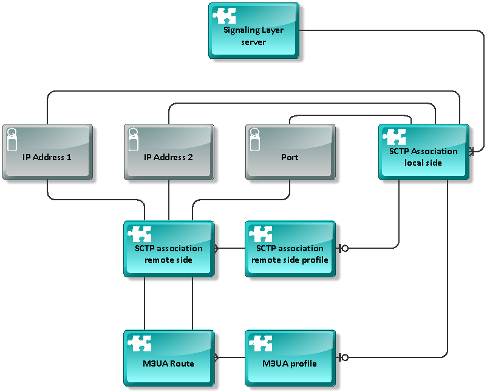

[[_configuration]]
= Configuration

This section explains how to configure IM-SCF domains. Since IM-SCF
domain configuration is stored in a human-readable XML file, all
configuration can be done by editing this XML file. However, manually
editing this XML file is prone to human errors so helper scripts are
provided for the everyday tasks.

[[_editing-xml-files-manually]]
== Editing XML files manually

There is a single XML configuration file for each domain in the oam01
machine. The file can be found at location

[class]`/usr/imscf/configuration/<domain>/<domain>_imscf_config.xml`

This file contains all information needed to set up the domain’s SL and
EL instances.

After you change the XML files either by hand, you should distribute the
configuration to the nodes. Use the [class]`distributeConfig.sh` script for that
purpose:
----
distributeConfig.sh [-l|--reloadLogConfig] [-a|--reloadIMSCFConfig]
[-b|reloadBothConfigs] <domain>
----
The script copies the log and IM-SCF configuration to the machines
belonging to the domain specified by the parameter <domain>. You can
optionally instruct the script to reload the logging (-l) or IM-SCF (-a)
or both (-b) configurations on the domain’s running instances.

*Important note:* When specifying “–a” or “–b” to instruct the domain’s
servers to reload their configuration, this configuration reload does
not affect SIGTRAN settings of the Signaling Layer servers.
After changing these settings, the affected Signaling Layer servers must
be restarted for the changes to take effect.

[[_configuring-logging]]
== Configuring logging

[[_configuring-logging-using-scripts]]
=== Configuring logging using scripts

You can use the setLogLevels.sh script on the OAM machine to set the log
levels on the desired domains.
----
$ setLogLevels.sh

Setting IM-SCF Environment
This is a PILOT node on pilot-oam01

ERROR: domain must be specified
Usage:

/home/imscfadmin/startup/logconfig/setLogLevels.sh [-d DOMAIN|--domain
DOMAIN] [-t TYPE|--type TYPE] [-l LEVEL|--level LEVEL] [-s LEG|--side
LEG] [-h|--help]
----
Sets the current loglevel given by the level parameter of the given
domain and type. The leg parameter is mandatory, if the domain is used
in split mode!
Where the domain is the name of the domain without the SL/EL postfixes,
e.g. gyor, sless, sful, and the type is the type of the domain (SL or
EL).
The acceptable types are only SL and EL (the script is case insensitive
in this regard). The acceptable loglevels are: TRACE, DEBUG, INFO, WARN,
ERROR.
This parameter is also case insensitive.

In most cases, the –d (domain), -t (type) and –l (level) parameters are
used, so for example for setting the log level of EL servers in sful
domain to WARN, issue:
----
$ setLogLevels.sh –d sful –t EL –l WARN
----
After the logging configuration files are changed, invoke the
distributeConfig.sh command as imscfadmin:
----
$ distributeConfig.sh [-l] <domain>
----
The <domain> parameter specifies the target domain where the
configuration change has been done. If you specify the optional –l (that
is small letter “L”) flag, the logging configuration will be reloaded
runtime in the running instances of the domain.

*Important: as seen in Editing XML files manually the
[class]`distributeConfig.sh` script copies the IM-SCF configuration files
together with logging configuration so if you have modified the IM-SCF
configuration, be prepared that this script copies it to the target
machines!*

It is possible to query the current logging settings with the script
[class]`showLogLevels.sh`. The two required parameters are the domain (e.g.
“sless”) and the server type (“SL” or “EL”). For example:
----
$ showLogLevels.sh sful EL
Setting IM-SCF Environment
This is a PILOT node on pilot-oam01 
The current loglevel of the sful domain with the type of EL is: WARN
----
[[_configuring-logging-using-logback-xml-files]]
=== Configuring logging using logback XML files

IM-SCF instances main log is written into file imscf.log, see section
Log files. The layout and the level of logging can be configured
separately for SL and EL instances in XML files. The XML files for SL
and EL instances are in files

[class]`/usr/imscf/configuration/<domain>/<domain>_sl_logback.xml`
[class]`/usr/imscf/configuration/<domain>/<domain>_el_logback.xml`

respectively.

IM-SCF logging level in the shipped configuration is set to level WARN
which logs only suspicious or erroneous situations. This is usually
sufficient but there can be situations when the operational team wants
to see more detailed information about the behavior of IM-SCF, in this
case the level has to be set lower.

To change the log level, modify the files at the part below:
----
<root level="**WARN**">
<appender-ref ref="APPLOG"/>
</root>
----
The options to change the “WARN” above are following:

* INFO: IM-SCF startup/shutdown events are logged as well
* DEBUG: Call handling information events are logged as well. This
usually includes main decision points. This level is usually producing
hundreds of lines per call
* TRACE: Logs every event during a call handling. This level can produce
thousand lines per call

After the logging configuration files are changed, invoke the
[class]`distributeConfig.sh` command as imscfadmin:
----
$ distributeConfig.sh [-l] <domain>
----
The <domain> parameter specifies the target domain where the
configuration change has been done. If you specify the optional –l (that
is small letter “L”) flag, the logging configuration will be reloaded
runtime in the running instances of the domain.

*Important:* as seen in section “Editing XML files manually” the
distributeConfig.sh script copies the IM-SCF configuration files
together with logging configuration so if you have modified the IM-SCF
configuration, be prepared that this script copies it to the target
machines!

[[_im-scf-configuration-reference]]
== IM-SCF configuration reference

The parts below explain the structure of the IM-SCF configuration XML.

[[_sigtran-configuration]]
=== SIGTRAN configuration

[[_sctp-and-m3ua]]
==== SCTP and M3UA

For a Signaling Layer server’s SCTP and M3UA configuration, profiles are
used. The overview of the entities is shown on the following figure.

[source,xml]
----
<?xml version="1.0" encoding="UTF-8"?>
<imscfConfig version="1.0" xmlns="http://common.imscf.restcomm.org/config">
	<sctpAssociationRemoteSides>
		<sctpAssociationRemoteSide name="RS-MSS0A">
			<remoteSystemType>SG</remoteSystemType>
			<associationType>m3ua</associationType>
			<remoteIp1>10.133.128.2</remoteIp1>
			<remoteIp2>10.133.192.2</remoteIp2>
			<remotePort>2905</remotePort>
		</sctpAssociationRemoteSide>
----
The configuration XML starts with defining _SCTP association remote
sides_:

An _SCTP association remote side_ has a name, remote IP addresses (IP2 is
optional) and a remote port. The element _remoteSystemType_ is always set
to “SG”, the value of the element _associationType_ are can be set to
“m3ua”.

An _SCTP association remote side_ can then be referenced by name in an
_SCTP association remote side profile_ or in an _M3UA route_. 

----
Defining _M3UA profiles_ and _routes_:
[source,xml]
----
<m3uaProfiles>
	<m3uaProfile name="M3UA_ALL">
		<routingContext>5</routingContext>
		<ss7SignalingMode>itu14</ss7SignalingMode>
		<m3uaRoutes>
			<m3uaRoute name="MSS0">
				<pointCode>280</pointCode>
				<primaryAssociation>RS-MSS0A</primaryAssociation>
				<secondaryAssociation>RS-MSS0B</secondaryAssociation>
			</m3uaRoute>
			<m3uaRoute name="MSS1">
				<pointCode>281</pointCode>
				<primaryAssociation>RS-MSS1A</primaryAssociation>
				<secondaryAssociation>RS-MSS1B</secondaryAssociation>
			</m3uaRoute>
----

An M3UA profile consists of multiple _M3UA routes_. A route defines the
primary and secondary SCTP associations towards a point code, so the
value between the _primaryAssociation_ and _secondaryAssociation_ tags must
match a name attribute of an _sctpAssociationRemoteSide_ tag seen above.

SCTP configuration of a Signaling Layer server is manifested in its _SCTP
association local side_ setting. This setting sets the local SIGTRAN
addresses, and references either an _M3UA profile_ or an _SCTP association remote side profile_. 
Note that an SL server can have multiple _SCTP association local sides_.

Example of an SL server with M3UA profile:
[source,xml]
----
<signalingLayerServers>
	<signalingLayerServer name="sfulSL01a">
		( … )
		<sctpAssociationLocalSides>
			<sctpAssociationLocalSide>
				<sigtranIp1>10.133.1.1</sigtranIp1>
				<sigtranIp2>10.133.1.2</sigtranIp2>
				<port>2905</port>
				<side>client</side>
				<m3uaProfile>M3UA_ALL</m3uaProfile>
			</sctpAssociationLocalSide>
		</sctpAssociationLocalSides>
		( … )
	</signalingLayerServer>
----
[[_sccp]]
==== SCCP

SCCP configuration is split into _local_ and _remote profiles_. The _local
profile_ defines the _local subsystems_ and _local global title addresses_.
Note that an IM-SCF domain can have multiple subsystems and GT addresses
but in current installation only one subsystem and GT is used per IM-SCF
domain.
[source,xml]
----
<sccpLocalProfile>
	<localNetworkIndicator>national</localNetworkIndicator>
	<removePcWhenRouteOnGt>true</removePcWhenRouteOnGt>
	<localSubSystems>
		<localSubSystem alias="IMSCF-SSN">
			<subSystemNumber>146</subSystemNumber>
		</localSubSystem>
	</localSubSystems>
	<localGtAddresses>
		<localGtAddress alias="IMSCF-GT">
			<globalTitle>36309879049</globalTitle>
			<subSystemNumber>146</subSystemNumber>
			<gtIndicator>4</gtIndicator>
			<gtNoa>4</gtNoa>
			<gtNumberingPlan>1</gtNumberingPlan>
			<gtTranslationType>0</gtTranslationType>
		</localGtAddress>
	</localGtAddresses>
</sccpLocalProfile>
----
The SCCP remote profile defines the remote systems and their addressing.
_Remote systems_ which are addressed by point code and subsystem number
are listed under _remoteSubSystemPointCodeAddresses_:
[source,xml]
----
<sccpRemoteProfile>
	<remoteSubSystemPointCodeAddresses>
		<remoteSubSystemPointCode alias="HLRFE0">
			<subSystemNumber>6</subSystemNumber>
			<pointCode>216</pointCode>
			<networkIndicator>national</networkIndicator>
		</remoteSubSystemPointCode>
		( … )
	</remoteSubSystemPointCodeAddresses>
----
_Remote systems_ addressed by global title are listed under
_remoteGtAddresses_:
[source,xml]
----
<sccpRemoteProfile>
	<remoteSubSystemPointCodeAddresses>
	( … )
	</remoteSubSystemPointCodeAddresses>
	<remoteGtAddresses>
		<remoteGtAddress alias="MSS0">
			<globalTitle>36309489980</globalTitle>
			<subSystemNumber>146</subSystemNumber>
			<gtIndicator>4</gtIndicator>
			<gtNoa>4</gtNoa>
			<gtNumberingPlan>1</gtNumberingPlan>
			<gtTranslationType>0</gtTranslationType>
			<networkIndicator>national</networkIndicator>
			<pointCode>280</pointCode>
		</remoteGtAddress>
		( … )
	</remoteGtAddresses>
----
You can configure Global Title routing right after remote GT addresses:
[source,xml]
----
<sccpRemoteProfile>
	<remoteSubSystemPointCodeAddresses>
	( … )
	</remoteSubSystemPointCodeAddresses>
	<remoteGtAddresses>
	( … )
	</remoteGtAddresses>
	<gtRouting>
		<primaryGttPointCode>281</primaryGttPointCode>
		<secondaryGttPointCode>282</secondaryGttPointCode>
		<distribution>loadbalance</distribution>
	</gtRouting>
</sccpRemoteProfile>
----
The elements below gtRouting configure GT translation. The
primaryGttPointCode element is mandatory, its value is the point code
which can provide global title translation. You can specify another
GTT-capable point code in secondaryGttPointCode. The value of the
element distribution can be either “loadbalance” or “failover”
specifying how to query the point codes set above.

[[_camel-configuration]]
=== CAMEL configuration

Configuring CAMEL parameters of an IM-SCF domain is basically means
defining _CAP modules_. _CAP modules_ process and construct CAMEL messages
which are received from and sent to the telco network.

_CAP modules_ reference media resources, which are listed separately:
[source,xml]
----
<mediaResources>
	<mediaResource name="MRF">
		<alias>mrf</alias>
		<addressDigits>03</addressDigits>
		<natureOfAddress>national</natureOfAddress>
		<numberingPlan>ISDN</numberingPlan>
	<bothwayThroughConnectionInd>bothwayPathRequired</bothwayThroughConnectionInd>
	</mediaResource>
	<mediaResource name="MRF_FREE">
		<alias>mrf1</alias>
		<addressDigits>03</addressDigits>
		<natureOfAddress>national</natureOfAddress>
		<numberingPlan>ISDN</numberingPlan>
	<bothwayThroughConnectionInd>bothwayPathNotRequired</bothwayThroughConnectionInd>
	</mediaResource>
</mediaResources>
----
_CAP modules_ are then defined below the “capModules” tag, one “capModule”
tag for each module.
[source,xml]
----
<capModules>
	<capModule name="cap2Module">
		<localGt>IMSCF-GT</localGt>
		<inTriggering>
		( … )
		</inTriggering>
		<generalProperties>
		( … )
		</generalProperties>
		<sipProperties />
		<mediaResources>
		( … )
		</mediaResources>
		<inviteErrorHandlers>
		( … )
		</inviteErrorHandlers>
	</capModule>
	( … )
</capModules>
----
As you can see, a _CAP module_ has a name and a local address. In the
example above the local address is given in the “localGT”, its value
must reference a _localGtAddress_ in the _SCCP local profile_. Of course the
local address can be given by referencing a _localSubSystem_ in the _local
SCTP profile_:
[source,xml]
----
<capModules>
	<capModule name="cap2Module">
		<localSsn>IMSCF-SSN</localSsn>
		<inTriggering>
		( … )
----
The “inTriggering” part specifies what triggering should be used in
stateful services. It specifies the events to subscribe to in the
outgoing requestReportBCSMEvent message and the monitoring type as well
(interrupted or notify-and-continue).

The settings under the “generalProperties” tag configure various
properties of call handling and timeouts:

* reset timer intervals in seconds
* activityTest interval in seconds (after how many seconds of inactivity
of a call must an activityTest message to be sent)
* asReactionTimeoutSec: how many seconds after the INVITE should the SIP
AS answer
* maxCallLengthMinutes: the longest time in minutes a call can last

At “mediaResources” the media resources shown above are referenced.

The “inviteErrorHandlers” part describes what should IM-SCF do in case
when the AS replies to SIP INVITE with an error. The behavior can be
separated by service key as well.

[[_map-configuration]]
=== MAP configuration

MAP configuration is about to define MAP modules in IM-SCF:
[source,xml]
----
<mapModules>
	<mapModule name="mapModule">
		<localSsn>IMSCF-SSN</localSsn>
		<mapGsmScfAddress>
			<numberingPlan>ISDN</numberingPlan>
			<noa>international</noa>
			<address>36309879049</address>
		</mapGsmScfAddress>
		<mapTimeoutSec>8</mapTimeoutSec>
	</mapModule>
</mapModules>
----
A MAP module has a unique name and a local address. In the example above
the local address is defined by referencing a _localSubSystem_ in the _SCTP
local profile_ but it could reference a _localGtAddress_ as well:
[source,xml]
----
<mapModules>
	<mapModule name="mapModule">
		<localGt>IMSCF-GT</localGt>
		( … )
----
The _mapGsmScfAddress_ specifies the GSM-SCF address to write to the
outgoing anyTimeInterrogation MAP message. The “mapTimeoutSec” specifies
the timeout in seconds to wait for the answer the outgoing MAP message.

----
[[_sip-configuration]]
=== SIP configuration

SIP configuration in IM-SCF means configuring the SIP AS endpoints. SIP
AS endpoints are grouped into _AS groups_. A call is routed to an _AS group_
and an _AS group_ can have multiple _SIP AS_ inside. The distribution of the
group (load-balance, fail-over) is defined in the _AS group_.
[source,xml]
----
<sipApplicationServers>
	<heartbeatConfiguration>
		<timeoutSec>5</timeoutSec>
		<activeIntervalSec>10</activeIntervalSec>
		<inactiveIntervalSec>30</inactiveIntervalSec>
	</heartbeatConfiguration>
	<sipApplicationServerGroups>
		<sipApplicationServerGroup name="tsdp5f_calltester_camel">
			<distribution>loadbalance</distribution>
			<sipApplicationServer name="calltester_camel-1">
				<host>192.168.1.111</host>
				<port>8625</port>
				<heartbeatEnabled>true</heartbeatEnabled>
			</sipApplicationServer>
			<sipApplicationServer name="calltester_camel-2">
				<host>192.168.1.112</host>
				<port>8625</port>
				<heartbeatEnabled>true</heartbeatEnabled>
			</sipApplicationServer>
			( … )
		</sipApplicationServerGroup>
		( … )
	</sipApplicationServerGroups>
</sipApplicationServers>
----
All SIP AS endpoints are monitored by IM-SCF if they are alive or not.
This monitoring is done by sending SIP OPTIONS messages to the AS and
waiting for a SIP 200 OK answer. This behavior is configured in the
“heartbeatConfiguration” part:

* timeoutSec is the number of seconds to wait for the 200 OK answer.
After the time is elapsed and no answer arrived, the corresponding SIP
AS will be marked unavailable and IM-SCF will not route calls there
until it becomes available again
* activeIntervalSec is the number of seconds elapsed between two SIP
OPTIONS requests sent by IM-SCF when the SIP AS is considered to be
available
* inactiveIntervalSec is the number of seconds elapsed between two SIP
OPTIONS requests sent by IM-SCF when the SIP AS is unavailable

SIP AS groups and their SIP AS instances are defined under the
“sipApplicationServerGroups” tag. Note that IM-SCF operational scripts
help you modify these structures so this part is not advised to be
edited by hand.

[[_routing-configuration]]
=== Routing configuration

The following routing can be defined for an IM-SCF domain

* Route incoming calls (InitialDPs) by service key to SIP AS group
* Route incoming TCAP BEGIN messages by application context to an
appropriate module

[[_route-calls-to-sip-as-group]]
==== Route calls to SIP AS group

Routing is configured by adding _sipAsRoutingEntry_ elements under the
_sipAsRouting_ tag:
[source,xml]
----
<sipAsRouting>
	<sipAsRoutingEntry>
		<routingCriterias>
			<routingCriteria>
				<serviceKeyRangeList>1-35565</serviceKeyRangeList>
			</routingCriteria>
		</routingCriterias>
		<sipApplicationServerGroups>
			<sipApplicationServerGroupWrapper>
			<sipApplicationServerGroup>tsdp5f_calltester_camel</sipApplicationServerGroup>
			</sipApplicationServerGroupWrapper>
		</sipApplicationServerGroups>
	</sipAsRoutingEntry>
</sipAsRouting>
----
A _sipAsRoutingEntry_ has two nested elements: the routingCriterias part
configures when the current rule is active (in the example above it will
be active if the service key is between 1 and 35565, incusive). The
second element is _sipApplicationServerGroups_ where we list the SIP AS
groups to route the call to. Note that specifying more than one
_sipApplicationServerGroup_ means the service is concatenated. Important
to remark that concatenation is not supported in phase one of IM-SCF
introduction but the configuration structure is prepared for it.

Managing criteria and target application server groups is easier and
safer to do through the scripts shipped with IM-SCF, see Using IM-SCF
configuration scripts.

[[_route-tcap-begin-to-module]]
==== Route TCAP BEGIN to module
[source,xml]
----
<moduleRouting>
	<moduleRoutingEntry>
		<!-- Route CAP2 to a specific module -->
		<routingCriterias>
			<routingCriteria>
				<applicationContext>cap2</applicationContext>
			</routingCriteria>
		</routingCriterias>
		<mapModule>cap2Module</mapModule>
	</moduleRoutingEntry>
	<moduleRoutingEntry>
		<routingCriterias>
			<routingCriteria>
				<applicationContext>map</applicationContext>
			</routingCriteria>
		</routingCriterias>
		<capModule>mapModule</capModule>
	</moduleRoutingEntry>
	<moduleRoutingEntry>
		<routingCriterias />
		<capModule>defaultCapModule</capModule>
	</moduleRoutingEntry>
</moduleRouting>
----
The example above:

* routes TCAP BEGIN messages with cap2 application context to cap2Module
* routes TCAP BEGIN messages with map application context to mapModule
* and any other TCAP BEGIN messages with defaultCapModule – which is the
CAP module defined for CAMEL phase 3-4 calls

The application context can be: cap2, cap3, cap4 and map.

The criteria can be a service key range as well: this way it is possible
to route a call to different modules based on service key.

[[_notification-configuration]]
==== Notification configuration

MBean notifications can be configured at the element
“notificationConfiguration”. Notifications can be defined for various
counter changes: MAP operation count, CAP operation count. The three 
types of notifications each is collected by some kind of service identifier. 
In case of CAP operation count, it is service key 
(serviceKeyCounterThresholdNotifications), in case of MAP 
(mapCounterThresholdNotifications) it is the remote system alias-
[source,xml]
----
<notificationConfiguration>
	<serviceKeyCounterThresholdNotifications>
		<serviceKeyCounterThresholdNotification>
			<thresholdLow>1</thresholdLow>
			<thresholdHigh>3</thresholdHigh>
			<notificationWhenLowFromBelow>false</notificationWhenLowFromBelow>
			<notificationWhenLowFromAbove>true</notificationWhenLowFromAbove>
			<notificationWhenHighFromBelow>true</notificationWhenHighFromBelow>
			<notificationWhenHighFromAbove>false</notificationWhenHighFromAbove>
			<notificationText>On server ${serverName} counter ${counterName} of service key ${serviceKey} crossed the ${highLow} threshold (${thresholdValue}) from ${aboveBelow}.</notificationText>
			<counterName>initialDpCount</counterName>
		</serviceKeyCounterThresholdNotification>
	</serviceKeyCounterThresholdNotifications>
	<mapCounterThresholdNotifications/>
</notificationConfiguration>
----
For example the notification configuration above will send a
notification every time the number of calls drops below 1 or inceases
above 3. (The two thresholds are 1 and 3. The value of element
notificationWhenLowFromAbove is true, so the notification will be sent
when the low threshold (1) is crossed from above. The value of element
notificationWhenHighFromBelow is true, so the notification will be sent
when the high threshold (3) is crossed from below.)

The notification text can contain variables:

* serverName – the name of the server instance, e.g. sfulEL02b
* counterName – the name of the counter which crossed a threshold
* serviceKey – the service the counter of which has crossed a threshold
(only available for service key counter notifications)
* highLow – contains the words either “high” or “low” depending on which
threshold has been crossed
* aboveBelow – contains the words either “above” or “below” depending on
the threshold has been crossed from above or from below
* thresholdValue – the configured threshold which has just been crossed
* serviceIdentifier – the alias of the remote system (service), e.g.
“HLRFE1” or “ROAMINGSMS” (only available for MAP counter
notifications)

The three types of notifications obviously can be configured to watch
different counter values. In case of CAP, the following counter names
are available:

* activityTestRequestCount
* activityTestResponseCount
* applyChargingCount
* applyChargingReportCount
* callInformationReportRequestCount
* callInformationReportResponseCount
* cancelCount
* connectCount
* connectToResourceCount
* continueCount
* continueWithArgumentCount
* disconnectForwardConnectionCount
* disconnectForwardConnectionWithArgumentCount
* disconnectLegCount
* eventReportBcsmCount
* furnishChargingInformationCount
* initialDpCount
* initiateCallAttemptRequestCount
* moveLegRequestCount
* moveLegResponseCount
* playAnnouncementCount
* promptAndCollectUserInformationCount
* promptAndCollectUserInformationResultCount
* releaseCallCount
* requestReportBcsmEventCount
* resetTimerCount
* returnResultLastCount
* specializedResourceReportCount
* splitLegCount
* tcapReceivedCount
* tcapBeginReceivedCount
* tcapContinueReceivedCount
* tcapEndReceivedCount
* tcapAbortReceivedCount
* tcapSentCount
* tcapBeginSentCount
* tcapContinueSentCount
* tcapEndSentCount
* tcapAbortSentCount

The following MAP counters can be watched:

* anyTimeInterrogationCount
* anyTimeInterrogationResultCount
* tcapReceivedCount
* tcapBeginReceivedCount
* tcapContinueReceivedCount
* tcapEndReceivedCount
* tcapAbortReceivedCount
* tcapSentCount
* tcapBeginSentCount
* tcapContinueSentCount
* tcapEndSentCount
* tcapAbortSentCount

[[_instance-configuration]]
=== Instance configuration

IM-SCF instances can be defined under the “servers” tag
[source,xml]
----
<servers>
	<signalingLayerServers>
		<signalingLayerServer name="sfulSL01a">
			<poolConfig>SLPoolConfig</poolConfig>
			<connectivity>
				<internalCommunicationAddress>
					<host>192.168.2.21</host>
					<port>12113</port>
				</internalCommunicationAddress>
				<administrationAddress>
					<host>192.168.2.21</host>
					<port>12111</port>
				</administrationAddress>
			</connectivity>
			<sctpAssociationLocalSides>
				<sctpAssociationLocalSide>
				( … see SIGTRAN configuration … )
				</sctpAssociationLocalSide>
			</sctpAssociationLocalSides>
			<pointCode>395</pointCode>
			<mtpDeliveryTransferMessageThreadCount>8</mtpDeliveryTransferMessageThreadCount>
			<sctpWorkerThreadCount>1</sctpWorkerThreadCount>
		</signalingLayerServer>
		( … )
	</signalingLayerServers>
	<executionLayerServers>
		<executionLayerServer name="sfulEL01a">
			<poolConfig>ELPoolConfig</poolConfig>
			<connectivity>
				<internalCommunicationAddress>
					<host>192.168.2.21</host>
					<port>32113</port>
				</internalCommunicationAddress>
				<administrationAddress>
					<host>192.168.2.21</host>
					<port>32111</port>
				</administrationAddress>
				<sipListenAddress>
					<host>192.168.1.21</host>
					<port>32112</port>
				</sipListenAddress>
			</connectivity>
			<tcapTransactionIdRange>
				<minInclusive>1000000</minInclusive>
				<maxInclusive>1999999</maxInclusive>
			</tcapTransactionIdRange>
		</executionLayerServer>
		( … )
	</executionLayerServers>
</servers>
----
The following properties must be set for Signaling Layer servers:

* Name
* Pool Configuration: this is a technical parameter, controls the number
of threads, need not to be changed
* Internal Communication Address: SL and EL servers will communicate
through this port. See Domains, machines and processes
* Administration Address: administration functions are reachable through
this port
* SCTP Association Local Sides: see SIGTRAN configuration
* Point Code: the point code assigned to this SL server

The Execution Layer servers have the following additional properties
(and they do not have the SCTP Association Local Sides and Point Code
parameters):

* SIP Listen Address: address used for SIP communication with SIP AS
* TCAP Transaction ID range: The TCAP TID range used by this server.
Note that the ranges must not overlap among the EL servers of the same
IM-SCF domain

[[_overload-protection]]
=== Overload protection

Under the “overloadProtection” tag the SL and EL servers can be
configured when to enter overloaded state. When a server is in
overloaded state, it intentionally does not answer incoming requests (or
sends back error immediately) so it does not get to a state it could not
recover from. The configuration looks like the following:
[source,xml]
----
<overloadProtection>
	<enabled>true</enabled>
	<cpuOverloadThresholdPercent>80</cpuOverloadThresholdPercent>
	<cpuMeasurementWindow>10</cpuMeasurementWindow>
	<dataCollectionPeriodSec>3</dataCollectionPeriodSec>
	<heapOverloadThresholdPercent>90</heapOverloadThresholdPercent>
	<nonHeapOverloadThresholdPercent>90</nonHeapOverloadThresholdPercent>
</overloadProtection>
----
The following settings indicate that a server will be in overloaded
state when the average CPU usage is above 80 percent and the 90 of the
heap is already used. It should average the CPU from 10 measurements
which are taken every 3 seconds. These settings are proved to be safe
from earlier experiences.

[[_technical-parameters]]
=== Technical parameters

At the “lwCommParameters” section the IM-SCF configuration XML contains
some technical parameters which are not likely to change in time.

[[_using-im-scf-configuration-scripts]]
== Using IM-SCF configuration scripts

Configuring IM-SCF via editing the configuration XML file is prone to
errors, many mistakes can be made. Therefore IM-SCF provides some
scripts to ease the most common processes in IM-SCF maintenance.

[[_basics]]
=== Basics

The functionality is assembled into one script called [class]`imscfAdmin.sh`. You
can get help by invoking the script with -h or --help options:
----
$ imscfAdmin.sh -h
----
or
----
$ imscfAdmin.sh --help
----
The script is basically operated by specifying the target domain and a
command to execute. The commands of [class]`imscfAdmin.sh` can be divided into
two categories: commands which merely give info of the configuration
(non-modifying) and commands which actually alter the configuration
(modifying).

To issue a modifying command, an editing session must be established. An
editing session belongs to a single domain, is owned by the user logged
in and is created for altering the configuration on a so-called working
copy. Only one editing session can be active for a specific domain. The
editing session can be discarded or committed by its owner user.

When creating an editing session, the currently active configuration of
the domain is copied in a so-called working copy. Further modifying and
non-modifying commands are executed on this working copy. If the editing
session is discarded, the working copy is deleted and the active
configuration is not touched. If the editing session is committed the
following happens:

1.  A new configuration archive entry is created and the active and new
configuration is copied there. The timestamp and the user name is saved
here
2.  The active configuration is overwritten by the working copy
3.  The working copy is discarded

Since the imscfAdmin.sh script does not distribute the configuration
files, neither refreshes IM-SCF instances, you have to do this manually
by invoking the distributeConfig.sh as seen in section Editing XML files
manually.

You can start an editing session by issuing
----
$ imscfAdmin.sh <domain> --session start
----
The script checks if an editing session is active and creates a new one
if there was none. Gives an error if there is already an active editing
session for the given domain. Creating a new editing session basically
consists of placing a lock file and creating a working copy in the
directory [class]`/usr/imscf/configuration/<domain>/work`.

A lock file is a regular file in the directory
[class]`/usr/imscf/configuration/<domain>/work`. Creating a working copy
essentially means copying the file
[class]`/usr/imscf/configuration/<domain>/<domain>_imscf_config.xml` to
[class]`/usr/imscf/configuration/<domain>/work/<domain>_imscf_config_workingcopy.xml`.

The script gives an error if there is already an active editing session
for domain <domain>. To discard the editing session for domain <domain>
enter:
----
$ imscfAdmin.sh <domain> --session discard
----
The discard operation will delete the lock and workingcopy files created
by the start operation.

Editing session can be committed by issuing:
----
$ imscfAdmin.sh <domain> --session commit [commit_message]
----
When committing an editing session, above from applying changes, a new
configuration history entry is created. Configuration history of a
domain can be found in the directory
[class]`/usr/imscf/configuration/domain/history`. This directory contains
timestamped subdirectories which also contain the user name who made the
commit. The timestamped subdirectory contains two files:
[class]`<domain>_imscf_config_before.xml` and [class]`<domain>_imscf_config_after.xml`.
The prior contains the domain’s IM-SCF configuration when the editing
session was started, the latter contains the new configuration with
modifications. If the optional parameter commit_message is present, a
file named “comment” is created in the history directory with the
contents of the parameter value. It is advised to put quotation marks
around the message, e.g.
----
$ imscfAdmin.sh sless --session commit “Routed odomino to quarantine”
----
If you want to check if an editing session is active or not for a
specific domain, enter
----
$ imscfAdmin.sh <domain> --session status
----
Note that issuing a non-modifying command does not need an active
editing session. When there is no editing session started, the
non-modifying commands use the active configuration of the domain for
querying. When there is an active edit session, the non-modifying
commands read the information from the working copy so you can check the
modified version before committing.

[[_managing-sip-application-servers]]
=== Managing SIP Application Servers

As seen in SIP configuration SIP application servers are arranged into
SIP application server groups. You can list the AS groups configured
with the command --asGroups list:
----
$ imscfAdmin.sh <domain> --asGroups list [<name>]
----
If the optional <name> parameter is given, then only the groups which
contain the parameter’s value in their names will be listed.
----
$ imscfAdmin.sh sful --asGroups list domino

Setting IM-SCF Environment

This is a PILOT node on pilot-oam01

The given configuration file is loaded and valid!

SIP Application Server Groups

+-------------------------------------------------+-------+-------------------------+---------------+------+-------------------+

| imscf5c_odomino_camel instances with LOADBALANCE | INDEX | Application
Server Name | Host/IP | Port | Heartbeat Enabled |

+-------------------------------------------------+-------+-------------------------+---------------+------+-------------------+

| | 0 | odomino_camel-1 | 192.168.1.121 | 8314 | true |

+-------------------------------------------------+-------+-------------------------+---------------+------+-------------------+

+-------------------------------------------------+-------+-------------------------+---------------+------+-------------------+

| imscf5b_tdomino_camel instances with LOADBALANCE | INDEX | Application
Server Name | Host/IP | Port | Heartbeat Enabled |

+-------------------------------------------------+-------+-------------------------+---------------+------+-------------------+

| | 0 | tdomino_camel-1 | 192.168.1.121 | 8214 | true |

+-------------------------------------------------+-------+-------------------------+---------------+------+-------------------+
----
Add a new group:
----
$ imscfAdmin.sh <domain> --asGroups add <group_name> <distribution>
----
Where the parameters

* group_name – the unique name of the new group
* distribution – how the calls will be distributed among the contained
SIP application servers: “failover” or “loadbalance”

If there is already a group with the given groupname parameter, the
script signals an error and no change is made.

To delete an existing group:
----
$ imscfAdmin.sh <domain> --asGroups remove <group_name>
----
If there is no AS group with the name of the parameter, the script
returns with error and no change is made.

To change the distribution of an existing AS group:
----
$ imscfAdmin.sh <domain> --asGroups edit <group_name> <distribution>
----
SIP application server groups contain an ordered list of application
servers. You can use the list command of the --asGroups switch to list
groups with their application servers as seen above. You can manage SIP
application servers inside an application server group with the
--asHandling switch.

To add a SIP application server to a group use the “--asHandling add”
command:
----
$ imscfAdmin.sh <domain> --asHandling add <group_name> <as_name>
<host_port> <heartbeat> [<index>]
----
Where the parameters are the following:

* group_name – The name of the SIP application server group to add the
new server to. Must be the name of an existing group
* as_name – The name of the new SIP application server. Must be unique
in the group the server will be added to
* host_port – The SIP endpoint address of the new application server in
HOSTNAME:PORT format. E.g. 192.168.1.131:8611, or site2-imscfc1-sip:8611
* heartbeat – If IM-SCF should check the server’s availability with SIP
OPTIONS heartbeat messages. The value of the parameter can be either
“yes” or “no”.
* index – This optional parameter specifies where to insert the new
application server in the list. 0 means the beginning of the list, the
value can be any nonnegative integer. If the value is greater than or
equal to the current size of the list the new server is inserted as the
last element. This append behavior is the default when the parameter is
missing

To modify the SIP address of a SIP application server use the editSip
subcommand:

$ imscfAdmin.sh <domain> --asHandling editSip <group_name> <as_name>
<host_port>

The parameters “group_name” and “as_name” must refer to an existing SIP
AS group and a SIP AS inside it.

To switch the SIP OPTIONS heartbeat towards a SIP application server on
and off, use the editHb subcommand:

$ imscfAdmin.sh <domain> --asHandling editHb <group_name> <as_name>
<heartbeat>

The parameters “group_name” and “as_name” must refer to an existing SIP
AS group and a SIP AS inside it. The value of the parameter “heartbeat”
can be “yes” or “no” as seen above.

You can alter the order of the SIP application servers inside a group
with the “move” subcommand:
----
$ imscfAdmin.sh <domain> --asHandling move <group_name> <as_name>
<new_index>
----
The value of the parameter <new_index> is interpreted exactly like the
parameter <index> in the --asHandling add command.

To remove a SIP application server from a group, invoke the
imscfAdmin.sh script with “--asHandling remove” command
----
$ imscfAdmin.sh <domain> --asHandling remove <group_name> <as_name>
----
[[_configuring-sip-routing]]
=== Configuring SIP routing

The [class]`imscfAdmin.sh` script’s --asRouting switch can be used to check and
modify the SIP routing by service key. You can check the routing with
the listAll, listBySk, listByGroup subcommands
----
$ imscfAdmin.sh <domain> --asRouting listAll
----
----
$ imscfAdmin.sh <domain> --asRouting listBySk <service_key>
----
----
$ imscfAdmin.sh <domain> --asRouting listByGroup <group_name>
----
The listAll subcommand lists all SIP routing settings:
----
$ imscfAdmin.sh sless --asRouting listAll

Setting IM-SCF Environment

This is a PILOT node on pilot-oam01

The given configuration file is loaded and valid!

SIP Application Server Routings

+--------------------------------------------+---------------------------------------------+

| Routing Entry --- INDEX: 0 | |

+--------------------------------------------+---------------------------------------------+

| Routing Criteria Type | Routing Criteria Value |

| ServicKey Range List | 20012,28074 |

| ------------------------------------------ |
------------------------------------------- |

| Server Groups | |

| imscf5c_odomino_camel | |

+--------------------------------------------+---------------------------------------------+

+--------------------------------------------+---------------------------------------------+

| Routing Entry --- INDEX: 1 | |

+--------------------------------------------+---------------------------------------------+

| Routing Criteria Type | Routing Criteria Value |

| ServicKey Range List | 1-35565 |

| ------------------------------------------ |
------------------------------------------- |

| Server Groups | |

| imscf5a_calltester_all | |

+--------------------------------------------+---------------------------------------------+
----
The listBySk subcommand lists all routing entries which are configured
for the given service key. Not that only the first entry will be
activated, since the rule listed earlier has priority over the other
rules.
----
$ imscfAdmin.sh sless --asRouting listBySk 28040

Setting IM-SCF Environment

This is a PILOT node on pilot-oam01

The given configuration file is loaded and valid!

SIP Application Server Routings

+--------------------------------------------+---------------------------------------------+

| Routing Entry --- INDEX: 1 | |

+--------------------------------------------+---------------------------------------------+

| Routing Criteria Type | Routing Criteria Value |

| ServicKey Range List | 1-35565 |

| ------------------------------------------ |
------------------------------------------- |

| Server Groups | |

| imscf5a_calltester_all | |

+--------------------------------------------+---------------------------------------------+

The listByGroup lists all rules the target of which contains the given
SIP AS group.

$ imscfAdmin.sh sless --asRouting listByGroup imscf5c_odomino_camel

Setting IM-SCF Environment

This is a PILOT node on pilot-oam01

The given configuration file is loaded and valid!

SIP Application Server Routings

+-------------------------------------------+--------------------------------------------+

| Routing Entry --- INDEX: 0 | |

+-------------------------------------------+--------------------------------------------+

| Routing Criteria Type | Routing Criteria Value |

| ServicKey Range List | 20012,28074 |

| ----------------------------------------- |
------------------------------------------ |

| Server Groups | |

| imscf5c_odomino_camel | |

+-------------------------------------------+--------------------------------------------+
----
To add a new routing rule use the “--asRouting add” command:
----
$ imscfAdmin.sh <domain> --asRouting add <service_key_range>
<group_names> [<index>]
----
* service_key_range – comma-separated list of service keys and service
key ranges. Service key ranges are in the form “X-Y” where X must be
smaller than Y. For example, the following value includes all service
keys between 3 and 10: “3,4,5-7,8-10”
* group_names – comma-separated list of SIP application server group
names. The calls with the service keys above will be routed to these
groups in the order they appear here, so specifying more than one group
means service concatenation
* index – this optional parameter specifies where to insert the new rule
in the list. Zero means the beginning of the list, the value can be any
nonnegative integer. If the value is greater than or equal to the
current size of the rule list the new server is inserted as the last
element. This append behavior is the default when the parameter is
missing

To remove a routing rule use the “remove” subcommand. The index
specified can be determined by one of the list commands:
----
$ imscfAdmin.sh <domain> --asRouting remove <index>
----
To alter the list of the rules use the “--asRouting move” command:
----
$ imscfAdmin.sh <domain> --asRouting move <actual_index> <new_index>
----
The value of “actual_index” is to be determined with the listing
commands. The value of new_index must be given according to the rules
applied to the “index” parameter in the “--asRouting add” command.

There is a special “edit” command to quickly change the routing of a
service key (or service key range) instead of deleting an existing rule
and creating a new one in two steps:
----
$ imscfAdmin.sh <domain> --asRouting edit <service_key_range>
<group_names>
----
The command looks for exact <service_key_range> routing rule match and
if there is one, then <group_names> will be set as new target SIP
application server groups.

[[_other-commands]]
=== Other commands

To list all available commands of [class]`imscfAdmin.sh`, invoke the script with
the parameter --listCommands:
----
$ imscfAdmin.sh --listCommands
----
You can list all domains configured:
----
$ imscfAdmin.sh –listDomains
----
To validate the configuration in the current working copy, use the
--validate switch. Note that only valid configuration can be committed.
----
$ imscfAdmin.sh <domain> --validate
----
To list various parts of the configuration use the --configListing
switch:
----
$ imscfAdmin.sh <domain> --configListing <config_list_param>
----
Where the <config_list_param> specifies the entities which you want to
list from the configuration. The valid values are the following:

*SctpAssoc* – To list the SCTP associations configured as described in
section SCTP and M3UA. Example output:
----
+-----------+--------------+-------------+----------------+----------------+-------------+

| Name | Rem.Sys.Type | Assoc. Type | Remote IP 1 | Remote IP 2 | Remote
Port |

+-----------+--------------+-------------+----------------+----------------+-------------+

| RS-HLRFE0 | SG | m3ua | 10.133.147.17 | 10.133.211.17 | 2905 |

| RS-HLRFE1 | SG | m3ua | 10.133.151.17 | 10.133.215.17 | 2905 |

| RS-HLRFE2 | SG | m3ua | 10.133.144.33 | 10.133.208.33 | 2905 |

| RS-MSS0A | SG | m3ua | 10.133.128.2 | 10.133.192.2 | 2905 |

| RS-MSS0B | SG | m3ua | 10.133.128.6 | 10.133.192.6 | 2905 |

| RS-MSS1A | SG | m3ua | 10.133.129.2 | 10.133.193.2 | 2905 |

| RS-MSS1B | SG | m3ua | 10.133.129.6 | 10.133.193.6 | 2905 |

| RS-MSS2A | SG | m3ua | 10.133.131.10 | 10.133.195.10 | 2905 |

| RS-MSS2B | SG | m3ua | 10.133.131.14 | 10.133.195.14 | 2905 |

| RS-MSS3A | SG | m3ua | 10.133.132.2 | 10.133.196.2 | 2905 |

| RS-MSS3B | SG | m3ua | 10.133.132.6 | 10.133.196.6 | 2905 |

| RS-MSS4A | SG | m3ua | 10.133.133.2 | 10.133.197.2 | 2905 |

| RS-MSS4B | SG | m3ua | 10.133.133.6 | 10.133.197.6 | 2905 |

| RS-MSS5A | SG | m3ua | 10.133.134.2 | 10.133.198.2 | 2905 |

| RS-MSS5B | SG | m3ua | 10.133.134.6 | 10.133.198.6 | 2905 |

| RS-MSS6A | SG | m3ua | 10.133.135.2 | 10.133.199.2 | 2905 |

| RS-MSS6B | SG | m3ua | 10.133.135.6 | 10.133.199.6 | 2905 |

+-----------+--------------+-------------+----------------+----------------+-------------+
----
*M3uaProfiles* – To list the available M3UA profiles configured as
described in section SCTP and M3UA. Example output:
----
M3uaProfile: M3UA_ALL, Routing Context: 5, SS7 Singaling Mode: ITU_14

+--------+-----+---------------------+-----------------------+

| Name | PC | Primary Association | Secondary Association |

+--------+-----+---------------------+-----------------------+

| HLRFE0 | 216 | RS-HLRFE0 | |

| HLRFE1 | 202 | RS-HLRFE1 | |

| HLRFE2 | 203 | RS-HLRFE2 | |

| MSS0 | 280 | RS-MSS0A | RS-MSS0B |

| MSS1 | 281 | RS-MSS1A | RS-MSS1B |

| MSS2 | 282 | RS-MSS2A | RS-MSS2B |

| MSS3 | 283 | RS-MSS3A | RS-MSS3B |

| MSS4 | 284 | RS-MSS4A | RS-MSS4B |

| MSS5 | 285 | RS-MSS5A | RS-MSS5B |

| MSS6 | 286 | RS-MSS6A | RS-MSS6B |

+--------+-----+---------------------+-----------------------+
----
*SccpProfiles* – To list the SCCP local and remote profiles configured
as described in section SCCP. Example output:
----
+--------------------------------------------------------------------------------------------+

| SCCP Local Profile --- Local Network Indicator: NATIONAL, Remove PC
When Route On GT: true |

+--------------------------------------------------------------------------------------------+

SCCP Local Subsystems

+-----------+------------------+

| Alias | Subsystem Number |

+-----------+------------------+

| IMSCF-SSN | 146 |

+-----------+------------------+

SCCP Local GT Addresses

+----------+--------------+------------------+--------------+--------+-------------------+---------------------+

| Alias | Global Title | Subsystem Number | GT Indicator | GT Noa | GT
Numbering Plan | GT Translation Type |

+----------+--------------+------------------+--------------+--------+-------------------+---------------------+

| IMSCF-GT | 36309879052 | 146 | 4 | 4 | 1 | 0 |

+----------+--------------+------------------+--------------+--------+-------------------+---------------------+

+---------------------+

| SCCP Remote Profile |

+---------------------+

SCCP Remote Subsystem PC Addresses

+--------+------------------+-----+-------------------+

| Alias | Subsystem Number | PC | Network Indicator |

+--------+------------------+-----+-------------------+

| HLRFE0 | 6 | 216 | NATIONAL |

| HLRFE1 | 6 | 202 | NATIONAL |

| HLRFE2 | 6 | 203 | NATIONAL |

+--------+------------------+-----+-------------------+

SCCP Remote GT Addresses

+-----------+--------------+---------+---------+--------+--------------+----------------+-------------------+-----+

| Alias | Global Title | Subsys. | GT Ind. | GT Noa | GT Numb. Pl. | GT
Trans. Type | Network Indicator | PC |

+-----------+--------------+---------+---------+--------+--------------+----------------+-------------------+-----+

| MSS0 | 36309489980 | 146 | 4 | 4 | 1 | 0 | NATIONAL | 280 |

| MSS1 | 36309489981 | 146 | 4 | 4 | 1 | 0 | NATIONAL | 281 |

| MSS2 | 36309489982 | 146 | 4 | 4 | 1 | 0 | NATIONAL | 282 |

| MSS3 | 36309489983 | 146 | 4 | 4 | 1 | 0 | NATIONAL | 283 |

| MSS4 | 36309489984 | 146 | 4 | 4 | 1 | 0 | NATIONAL | 284 |

| MSS5 | 36309489985 | 146 | 4 | 4 | 1 | 0 | NATIONAL | 285 |

| MSS6 | 36309489986 | 146 | 4 | 4 | 1 | 0 | NATIONAL | 286 |

| HLRFE0FNR | 36309489916 | 222 | 4 | 4 | 1 | 250 | NATIONAL | 216 |

| HLRFE1FNR | 36309489900 | 222 | 4 | 4 | 1 | 250 | NATIONAL | 202 |

| HLRFE2FNR | 36309489900 | 222 | 4 | 4 | 1 | 250 | NATIONAL | 203 |

+-----------+--------------+---------+---------+--------+--------------+----------------+-------------------+-----+

GT Routing

+------------+--------------+--------------+

| Primary PC | Secondary PC | Distribution |

+------------+--------------+--------------+

| 280 | 280 | LOADBALANCE |

+------------+--------------+--------------+
----
*MediaResources* – To list the media resources available for CAP modules
configured as seen in section CAMEL configuration. Example output:
----
+----------+-------+----------------+----------+----------------+---------------------------+

| Name | Alias | Address Digits | Noa | Numbering Plan | Bothway |

+----------+-------+----------------+----------+----------------+---------------------------+

| MRF | mrf | 03 | NATIONAL | ISDN | BOTHWAY_PATH_REQUIRED |

| MRF_FREE | mrf1 | 03 | NATIONAL | ISDN | BOTHWAY_PATH_NOT_REQUIRED |

+----------+-------+----------------+----------+----------------+---------------------------+
----
*ModuleRoutings* – To list the module routings configured as described
in section Route TCAP BEGIN to module. Example output:
----
+------------------+----------------------------+

| Module | Routing Criterias |

+------------------+----------------------------+

| cap2Module | Application context: CAP_2 |

| mapModule | Application context: MAP |

| defaultCapModule | |

+------------------+----------------------------+
----
*Servers* – To list the configured SL and EL servers. Example output:
----
+--------------------------------+

| Servers of the Signaling Layer |

+--------------------------------+

slessSL01a

+--------------------------------+------------------------+-----+--------------------------------+

| Internal Communication Address | Administration Address | PC |

+--------------------------------+------------------------+-----+--------------------------------+

| 192.168.2.21:11113 | 192.168.2.21:11111 | 393 |

+--------------------------------+------------------------+-----+--------------------------------+

slessSL01a - SCTP Associations Local Side

+----------------+----------------+------+--------+--------------+--------------------------------------+

| Sigtran IP 1 | Sigtran IP 2 | Port | Side | M3ua Profile | SCTP |

+----------------+----------------+------+--------+--------------+--------------------------------------+

| 10.133.128.154 | 10.133.192.154 | 2905 | client | M3UA_ALL | |

+----------------+----------------+------+--------+--------------+--------------------------------------+

slessSL02a

+--------------------------------+------------------------+-----+--------------------------------+

| Internal Communication Address | Administration Address | PC |

+--------------------------------+------------------------+-----+--------------------------------+

| 192.168.2.22:11213 | 192.168.2.22:11211 | 394 |

+--------------------------------+------------------------+-----+--------------------------------+

slessSL02a - SCTP Associations Local Side

+----------------+----------------+------+--------+--------------+--------------------------------------+

| Sigtran IP 1 | Sigtran IP 2 | Port | Side | M3ua Profile | SCTP |

+----------------+----------------+------+--------+--------------+--------------------------------------+

| 10.133.128.158 | 10.133.192.158 | 2905 | client | M3UA_ALL | |

+----------------+----------------+------+--------+--------------+--------------------------------------+

+--------------------------------+

| Servers of the Execution Layer |

+--------------------------------+

+----------------+--------------------------------+------------------------+--------------------+----------------------+

| EL Server Name | Internal Communication Address | Administration
Address | SIP Listen Address | Transaction ID Range |

+----------------+--------------------------------+------------------------+--------------------+----------------------+

| slessEL01a | 192.168.2.21:31113 | 192.168.2.21:31111 |
192.168.1.21:31112 | 1999999-1999999 |

| slessEL01b | 192.168.2.21:31123 | 192.168.2.21:31121 |
192.168.1.21:31122 | 2999999-2999999 |

| slessEL02a | 192.168.2.22:31213 | 192.168.2.22:31211 |
192.168.1.22:31212 | 3999999-3999999 |

| slessEL02b | 192.168.2.22:31223 | 192.168.2.22:31221 |
192.168.1.22:31222 | 4999999-4999999 |

+----------------+--------------------------------+------------------------+--------------------+----------------------+
----
*SipAs* – To list the SIP application server groups. Example output:
----
SIP Application Server Groups

+----------------------------------------------------+-------+-------------------------+---------------+------+-------------------+

| imscf5a_calltester_all instances with LOADBALANCE | INDEX |
Application Server Name | Host/IP | Port | Heartbeat Enabled |

+----------------------------------------------------+-------+-------------------------+---------------+------+-------------------+

| | 0 | calltester_all-1 | 192.168.1.111 | 8115 | true |

| | 1 | calltester_all-2 | 192.168.1.112 | 8115 | true |

+----------------------------------------------------+-------+-------------------------+---------------+------+-------------------+

+----------------------------------------------------+-------+-------------------------+---------------+------+-------------------+

| imscf5a_calltester_camel instances with LOADBALANCE | INDEX |
Application Server Name | Host/IP | Port | Heartbeat Enabled |

+----------------------------------------------------+-------+-------------------------+---------------+------+-------------------+

| | 0 | calltester_camel-1 | 192.168.1.121 | 8125 | true |

| | 1 | calltester_camel-2 | 192.168.1.121 | 8125 | true |

+----------------------------------------------------+-------+-------------------------+---------------+------+-------------------+

+----------------------------------------------------+-------+-------------------------+---------------+------+-------------------+

| imscf5c_odomino_camel instances with LOADBALANCE | INDEX | Application
Server Name | Host/IP | Port | Heartbeat Enabled |

+----------------------------------------------------+-------+-------------------------+---------------+------+-------------------+

| | 0 | odomino_camel-1 | 192.168.1.121 | 8314 | true |

+----------------------------------------------------+-------+-------------------------+---------------+------+-------------------+
----
[[_deploying-new-im-scf-binaries]]
== Deploying new IM-SCF binaries

Like any other software, the IM-SCF system’s binaries will be refreshed
from time to time either because of bug fixing or new feature
implementation. The IM-SCF binaries consist of two files with the
extension of WAR:

* imscf-sl.war – for Signaling Layer
* imscf-el.war – for Execution Layer

The files should be placed into the directory
[class]`/home/imscfadmin/imscf/imscf_1_0/imscf_deployment` on the oam01 machine.
After copying invoke the distributeWars.sh script:

$ distributeWars.sh <domain>

for all affected domains, so replace the <domain> parameter above with
“sless”, “sful” and “hlr”.

This command copies the new binaries to all the nodes and directories
where the IM-SCF instances can find them. After distributing, the
command resetAll.sh should be called on all affected machines.